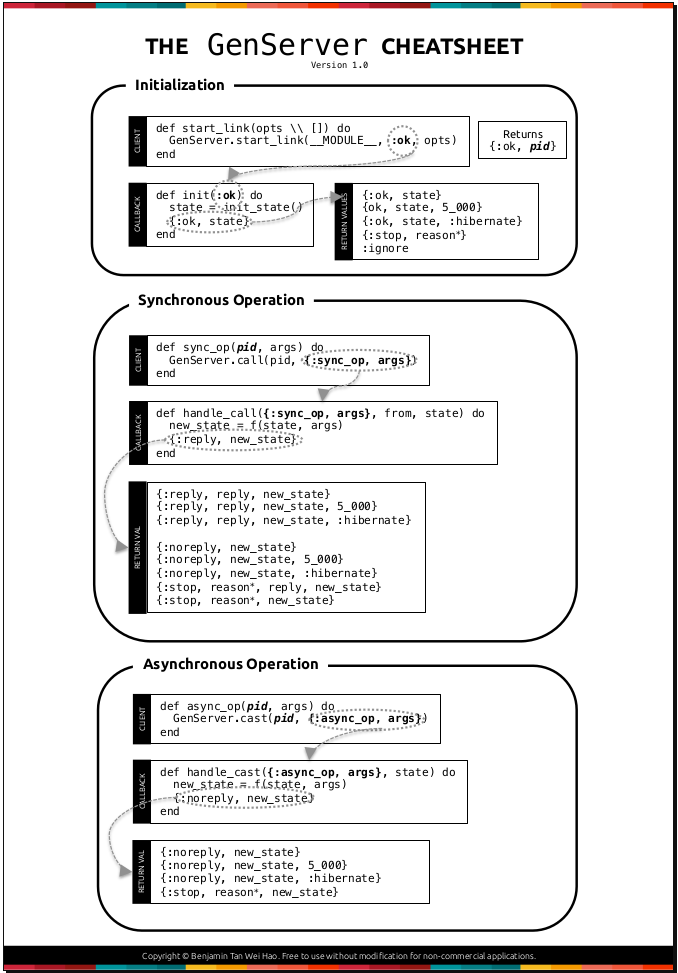
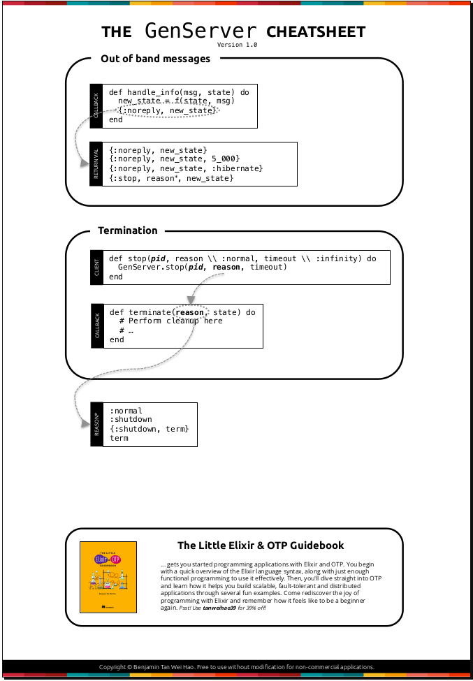

# Cheatsheet - Processes

In elixir - processes:
- are isolated from each other
- are not OS processes!
- are extremely lightweight in terms of memory & CPU
- [documentation](https://hexdocs.pm/elixir/Process.html)

## 'spawn'

Creates a new process without a link to the parent. That means if the child process dies then the parent continues to live. (see links below)
```
iex(1)> pid = spawn(fn -> 1 + 2 end)
#PID<0.105.0>
iex(2)> Process.alive?(pid)
false

 # self() returns the PID of the current process
iex(3)> self  
#PID<0.103.0>
```

## 'send' and 'receive'

- each process has a mailbox
- 'send' is a none-blocking operation
- useful in iex: flush/0 prints all message in mailbox
```
iex(1)> send self(), {:err, "Something went wrong"}
{:err, "Something went wrong"}
iex(2)> receive do
...(2)>  {:err, cause} -> "Error: " <> cause 
...(2)>  {:ok, msg} -> msg
...(2)> end
"Error: Something went wrong"

 # With timeout
"Error: Something went wrong"
iex(3)> receive do                         
...(3)>  {:err, cause} -> "Error: " <> cause
...(3)>  {:ok, msg} -> msg                  
...(3)> after
...(3)>  1_000 -> "Nothing happens after a second"
...(3)> end
"Nothing happens after a second"
```

## Links and Monitor

Links:
- Connects a parent process to its children
- Bi-directional: When one of them exits the other will exit, too

```
iex(1)> spawn_link fn -> raise "stop here" end
** (EXIT from #PID<0.103.0>) shell process exited with reason: an exception was raised:
    ** (RuntimeError) stop here
        (stdlib) erl_eval.erl:678: :erl_eval.do_apply/6

Interactive Elixir (1.7.4) - press Ctrl+C to exit (type h() ENTER for help)
iex(1)> 
12:31:23.121 [error] Process #PID<0.105.0> raised an exception
** (RuntimeError) stop here
    (stdlib) erl_eval.erl:678: :erl_eval.do_apply/6
```

Monitors:
 - For uni-directional
 - Process gets informed when monitored process exits or so

[Monitoring example - self built](./example_code/postcodes.ex)

Alternative Process.link/1 can also be used to create a link.

## Tasks

Task.start/1 replaces spawn/1 and Task.start_link/1 replaces spawn_link/1. This enables the use of task in supervision trees.

## Manage states with process

[See example - self built](./example_code/keyvalue_store.exs)

Built-in it is available in Elixir via [Agents](https://hexdocs.pm/elixir/Agent.html)

## GenServer

- For holding states
- For monitoring
- For callbacks in client/server architectures





[See example - self built](./example_code/postcodes.ex)

[Original source](https://github.com/benjamintanweihao/elixir-cheatsheets/)