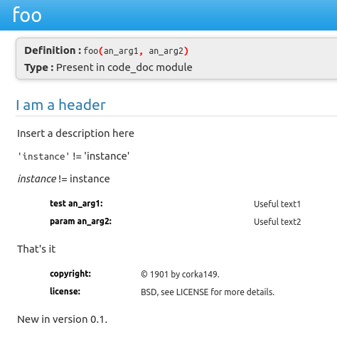

# Basics

## Inheritance
```
class Parent:
    
    def __init__(self, parent_text):
        self.__parent_text = parent_text
        
    def get_text(self):
        return self.__parent_text


class Child(Parent):
    
    def __init__(self, parent_text, child_text):
        super().__init__(parent_text)
        self.__child_text = child_text        
        
    def get_text(self):
        return super().get_text() + "/" + self.__child_text


c = Child("this is parent", "here child")
print(c.get_text())
```

## Tuple
They are immutable.
```
person = ("John", "Wayne")
name, surname = person
```

## Converting types
```
float("11.0)
int("15)
str(11)
```

## Strings
```
"Hi Mars".split()
"  Hi Mars  \n".strip()
"Hi Mars".replace("M", "W")

text = "Hi Mars"
text[-4:]                       # Returns 'Mars'

"Hi {0}".format("Mars")         # Returns 'Hi Mars'
```

## RegEx
```
import re

t = "Roses are red"
r = re.findall("[rR]", t)
print(r) 
# ['R', 'r', 'r']

r = re.search("[rR]", t)
print(r)
# <_sre.SRE_Match object; span=(0, 1), match='R'>
```

## Conditions
```
"a" in "Hallo"                  # True
1 in [1, 2, 3]                  # True
```

## Type checks
```
type("I am a string") == str    # True
isinstance("str", str)          # True
```

## Lists
```
l = [1, 2, 3]
l.append(4)
del [3]
new_l = [i ** 2 for i in l]
```

## Sorting
```
# sorts directly the elements
l.sort()                        
l.sort(reverse=True)
l.sort(key=len)
l.sort(key=lambda it: len(it))  # or -len() for reverse

# sorted does not change target
sorted(list, reverse=True)
```

## Queue
```
import queue
q = queue.Queue()
q.put("Jupiter")                # Adds element at the end
q.get()                         # Returns and removes first element
```

## Slicing
```
l = [1, 2, 3, 4, 5, 6, 7]
l[-1:] == 7                     # True
l[:4]                           # [1, 2, 3, 4]
```

## Dictionaries
```
places = {"DO": "Dortmund", "M": "Munich"}
for k, v in places.items():
    print(k + ": " + v)
print("DO" in places)           # True
places["HH"] = "Hamburg"
del places["M"]
places.get("H") == None         # True
```

## Default dictionairy

```
from collections import defaultdict
dd = defaultdict(int)
# Works even if key is not in dict (normal dict would fail)
dd["Bob"] += 1
```

## Argument list and dict
```
def show_args(*args, **kwargs):
    for a in args:
        print(a)
    for k, v in kwargs.items():
        print(k + ": ", v)


show_args(1, 2, three=3, four=4)
    # Output
    # 1
    # 2
    # three:  3
    # four:  4
```

## Sets
```
s = {"Mars"}
s = set()                       # Empty set
```

## Import modules and classes
```
import sys
from qtpy import QtWidgets as QT
```

## Lambda
```
f = lambda it, times: [print(it) for i in range(0, times)]
f("I am bread", 5)
```

## Decorator
```
def deco(times):
    def outer(f):
        def inner(message):
            for i in range(0, times):
                f(message)
        return inner
    return outer


@deco(5)
def print_message(m):
    print(m)

print_message("I am bread.")
```

## Modules
Files greeter.py and __ init __.py are in the same folder "my_module" (init without surrounded spaces)
```
# greeter.py
class ConsoleGreeter:
    def __init__(self, name):
        self.__name = name      # Private variable

    def greet(self, message):
        print(self.__name + " says: "+ message)
##########################
# __init__.py
__all__ = ["greeter"]  # Allows 'from my_module impot*'
from . import greeter  # Allows 'my_module.greeter.ConsoleGreeter

```

## Dates and time
```
from datetime import datetime, date, time, timedelta
now = datetime.now() # 2018-02-02 23:33:45.547982
now.strftime("%d.%m.%Y") # 02.02.2018
now + timedelta(days=20) # 2018-02-22 23:40:28.830889
last_year = date(2017, 5, 30) # Y:M:D
a_time = time(22, 55, 55) # H:M:S
```

## Error handling
```
try:
    print(1 / 0)
except ZeroDivisionError:
    print("Error")
finally:
    print("Happy End?")

class RandomError(Exception):
    pass
raise RandomError("Huch")
```

## File and dir handling
```
with open("students.csv", mode="r", encoding="utf-8") as f:
    for l in f:
        print(l.strip())
# is full path with name of py-file
print(__file__)

import os
dir_cont = os.listdir(".")
for it in dir_cont:
    print(os.path.isfile(it))
    print(os.path.isdir(it))

# os.path.dirname(__file__) returns path without file
os.path.join(os.path.dirname(__file__), "test.py")
```

## System arguments
```
import sys
if len(sys.argv) > 1:
    arg_two = sys.argv[1]
else:
    # is full path with name of py-file
    print(sys.argv[0])
```

## Useful
```
for i in range(0, 5):
    print(i)                # 0, 1, 2, 3, 4

str = input("Enter a name":)
```

## Special functions to overwrite
```
def __str__(self)       # str(my_obj)
def __len__(self)       # str(my_obj_list)
def __mul__(self)       # for '*' 
# etc...
```

## Code documentation
```
def foo(an_arg1, an_arg2):
    """
    I am a header
    ~~~~~~~
    Insert a description here
    
    ``'instance'`` != 'instance'
    
    `instance` != instance
    
    :test an_arg1: Useful text1
    :param an_arg2: Useful text2
    
    That's it
    
    :copyright: © 1901 by corka149.
    :license: BSD, see LICENSE for more details.
    .. versionadded:: 0.1
    """
    
    pass
```
Results to



[Back](README.md)